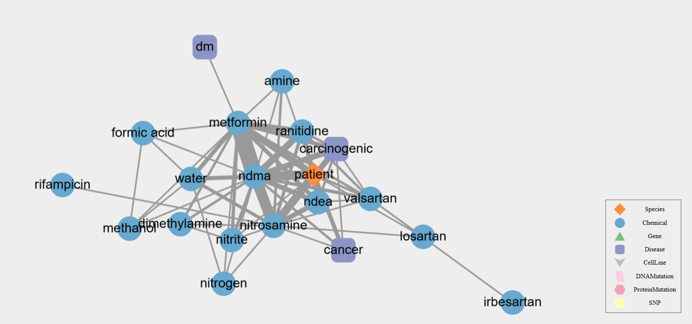

# Use Text Queries to Search Articles and Generate Networks

## Example: Find articles relevant to "N-dimethylnitrosamine" and "Metformin"

### Steps

Use the command `pubtator3` to retrieve articles. Here, we limit the results to the top 100 most recent articles by `--sort date` and `--max_articles 100`.  

```bash
pubtator3 -q '"N-dimethylnitrosamine" AND "Metformin"' -o ./output.pubtator --sort date --max_articles 100
```


Generate the network graph using `tocytoscape` and save as an HTML file.  

```bash
tocytoscape -i ./output.pubtator -o ./output.html -f html -w 2
```

**Result**

