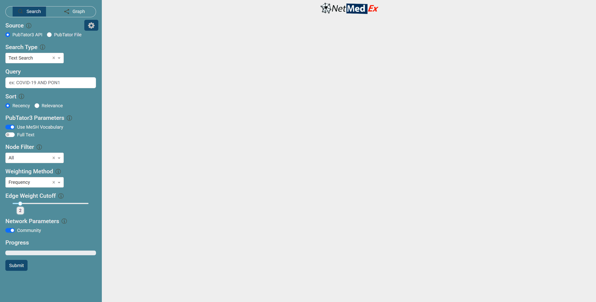
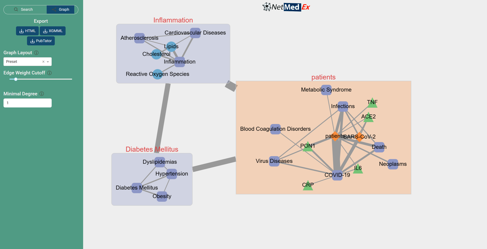
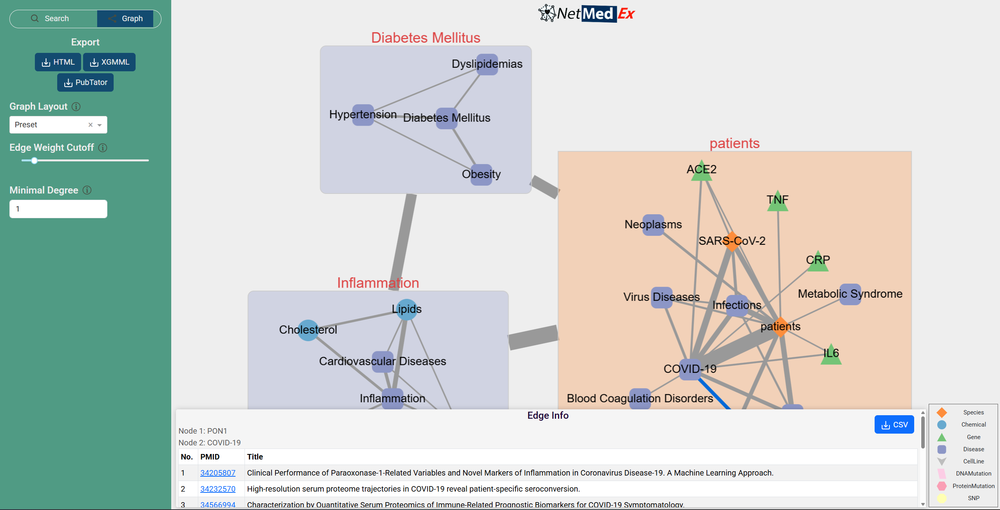

## Web Application

This is the typical interface when you open the app in your browser (`NetMedEx v0.3.0`).

_Note: The interface may vary slightly between versions._

The interface consists of a sidebar (background: ) and a region for network display (background: ).

## Usage

### Search Articles and Generate Networks (Default)

1. Select `PubTator3 API` in Source.
2. Select your [Search Type](reference.md#search-type).
3. Enter the corresponding inputs in the box below.
4. Adjust parameters in the sidebar and in the config panel () as needed (see [Reference](reference.md)).
5. Press `Submit`.

> **Note for Step 3:** If your search type is `Text Search`, use double quotes for keywords containing spaces and logical operators (e.g., AND/OR) to combine keywords. For example, "COVID 19" AND "PON1".

Once the program finishes generating the network, the sidebar will switch to the **Graph** panel and the resulting network will be displayed on the right:

_Note: In the default layout, some nodes may overlap. You can manually drag them to rearrange the network as desired._

In the sidebar, you will find buttons to download the network or adjust settings:

- `PubTator`: Download the corresponding PubTator file for reuse (see [Generate Networks from PubTator Files](#generate-networks-from-pubtator-files)).
- `HTML`: Export the network in HTML format.
- `XGMML`: Export the network in a Cytoscape-compatible format (see [Network Output Format](reference.md#network-output-format)).

Graph settings include graph layout, edge weight cutoff, minimum node degree, etc (see [Network Visualization Tools](reference.md#network-visualization-tools-web-app-only)).

> Tip: Adjusting `edge weight cutoff` is particularly useful if you think the current network is overcrowded or too sparse.

#### Interactive Network

The nodes in the network can be dragged around. Additionally, when you click on an edge, its information is displayed in the box at the bottom.

The evidence for the co-occurrence of two biological concepts that constitute the edge will be displayed as a table. This table is available as a CSV file.

If the `Community` parameter is enabled, the edges between nodes in different communities will be collapsed into a single community edge, which may include a long list of articles. To identify the evidence for nodes in separate communities, please disable the `Community` parameter and generate the network again.

### Generate Networks from PubTator Files

The downloaded PubTator files can be reused to generate networks without performing article searches. To generate networks from PubTator files:

1. Switch to the `Search` panel and select `PubTator File` in Source.
2. Upload the PubTator file.
3. Adjust the parameters as needed (see [Reference](reference.md)).
4. Press `Submit`.
